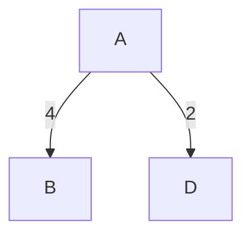
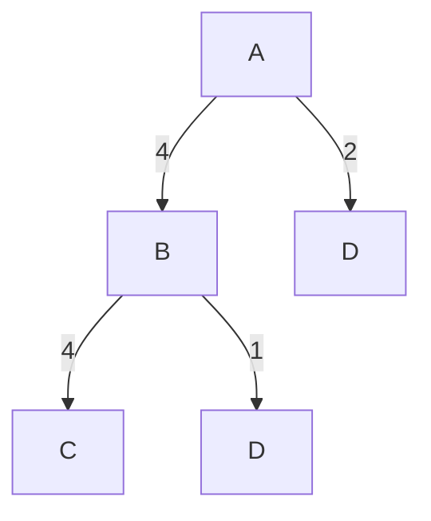
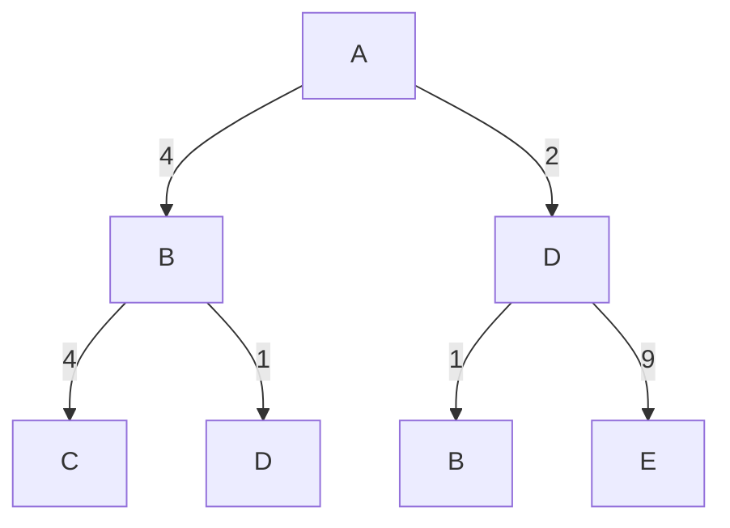
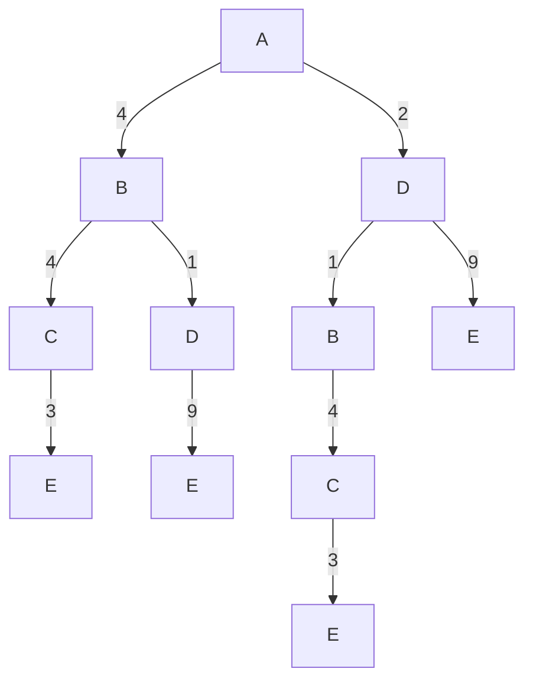

---
kernelspec:
  name: python3
  display_name: 'Python 3'
---

# 探索による問題解決

:::{important} Objective 
- コンピューターを使って問題を解決する方法を理解する
- アルゴリズムの基本的な考え方を学ぶ
- 簡単な最短経路問題を解けるようになる
- 探索アルゴリズムを用いて、さまざまな問題が解決できることを理解する
:::


## 考えてみよう

````{prf:example}
:nonumber:

田中さんは、法政大学のオープンキャンパスに参加するため、横浜駅から東小金井駅まで、できるだけ早く到着できるルートを探している。

下の図は、鉄道路線を簡略化したものである。各頂点は駅を、各辺は駅を結ぶ鉄道路線を表している。辺に付けられた数値は、それぞれの駅間を移動するのにかかる時間（分）である。

```{code-cell} python
:tags: [remove-input, remove-output]
!pip install networkx
import networkx as nx
import matplotlib.pyplot as plt
```

```{code-cell} python
:tags: [remove-input]

from typing import Dict, Tuple, List, Optional

# === Data Definitions ===

StationCoords = Dict[str, Tuple[float, float]]
EdgeList = List[Tuple[str, str, int]]

stations: StationCoords = {
    "Higashi-Koganei": (35.701549, 139.523898),
    "Shinjuku": (35.689732, 139.700908),
    "Yokohama": (35.466102, 139.622140),
    "Tokyo": (35.681320, 139.767218),
    "Hachioji": (35.655670, 139.338986),
}

edges: EdgeList = [
    ("Higashi-Koganei", "Shinjuku", 22),
    ("Shinjuku", "Yokohama", 33),
    ("Yokohama", "Tokyo", 26),
    ("Shinjuku", "Tokyo", 15),
    ("Higashi-Koganei", "Hachioji", 32),
    ("Hachioji", "Yokohama", 50),
]

# === Utility Functions ===


def create_graph(
    stations: StationCoords, edges: EdgeList, bidirectional: bool = True
) -> nx.Graph:
    G = nx.Graph() if bidirectional else nx.DiGraph()
    G.add_nodes_from(stations.keys())
    G.add_weighted_edges_from(edges)
    if bidirectional:
        reverse_edges = [(v, u, w) for u, v, w in edges]
        G.add_weighted_edges_from(reverse_edges)
    return G


def get_position_map(stations: StationCoords) -> Dict[str, Tuple[float, float]]:
    return {name: (lon, lat) for name, (lat, lon) in stations.items()}


def compute_shortest_path(
    G: nx.Graph, source: str, target: str
) -> Tuple[List[str], int]:
    path = nx.shortest_path(G, source=source, target=target, weight="weight")
    time = nx.shortest_path_length(G, source=source, target=target, weight="weight")
    return path, time


def draw_network(
    G: nx.Graph,
    pos: Dict[str, Tuple[float, float]],
    shortest_path: Optional[List[str]] = None,
) -> None:
    plt.figure(figsize=(8, 5))

    # === Draw base nodes and edges ===
    nx.draw_networkx_nodes(G, pos, node_size=100, node_color="#1f78b4", alpha=0.8)
    nx.draw_networkx_edges(G, pos, edge_color="lightgray", width=2)

    # === Highlight shortest path ===
    if shortest_path and len(shortest_path) > 1:
        path_edges = list(zip(shortest_path[:-1], shortest_path[1:]))
        nx.draw_networkx_edges(
            G, pos, edgelist=path_edges, edge_color="crimson", width=3, alpha=0.9
        )
        nx.draw_networkx_nodes(
            G,
            pos,
            nodelist=shortest_path,
            node_color="crimson",
            node_size=100,
            alpha=0.9,
        )

    # === Labels for nodes ===
    for station, (x, y) in pos.items():
        offset = 0.01 if station != "Yokohama" else -0.01
        va = "bottom" if station != "Yokohama" else "top"
        plt.text(
            x,
            y + offset,
            station,
            fontsize=10,
            ha="center",
            va=va,
            bbox=dict(
                facecolor="white", edgecolor="gray", boxstyle="round,pad=0.3", alpha=0.9
            ),
        )

    # === Edge labels (travel time) ===
    edge_labels = {(u, v): f"{d} min" for u, v, d in G.edges(data="weight")}
    nx.draw_networkx_edge_labels(G, pos, edge_labels=edge_labels, font_size=8)

    # === Decorations ===
    plt.title("Train Route Network", fontsize=14, fontweight="bold")
    plt.xlabel("")
    plt.ylabel("")
    plt.tight_layout()
    plt.show()


# Define source/target and execute
source = "Yokohama"
target = "Higashi-Koganei"

graph = create_graph(stations, edges)
pos = get_position_map(stations)

draw_network(graph, pos)
```

次の問題を考えてみよう。

1. 横浜駅から東小金井駅まで、どのルートを通ると、最も早く到着できるか？

```{code-cell} python
:tags: [hide-cell, remove-input]
# shortest path
path, time = compute_shortest_path(graph, source, target)
print("Best Route:", " ➝ ".join(path))
print("Estimated Time:", time, "minutes")
draw_network(graph, pos, shortest_path=path)
```

````

## 問題の理解

- 出発地：横浜駅
- 目的地：東小金井駅
- 手段：鉄道を利用して、駅から駅へ移動する
- 制約：与えられた鉄道路線図に従うこと
- 目標：移動にかかる時間が最も短い経路を見つけること

## モデリング

### 数学モデル

- **初期状態**：横浜駅
- **目標状態**：東小金井駅
- **状態空間**：横浜駅、東小金井駅、東京駅、八王子駅などの駅の集合
- **行動**：ある駅から隣接する駅へ移動すること
  - 横浜駅からは「東京駅へ行く」「八王子駅へ行く」「新宿駅へ行く」といった行動が可能
  - 東小金井駅からは「新宿駅へ行く」「八王子駅へ行く」といった行動が可能
- **状態遷移**：行動を実行することで、状態が変化する
  - 横浜駅から「八王子駅へ行く」と移動すると、状態は八王子駅に変わる
- **コスト**：各行動には、移動にかかる時間（分）というコストが発生する
  - 「八王子駅へ行く」行動は、移動時間が50分かかる

### 解と最適解

- **解**：初期状態から目標状態へ到達するための一連の行動
  - 横浜駅 -> 東京駅 -> 新宿駅 -> 東小金井駅
  - 横浜駅 -> 八王子駅 -> 東小金井駅
- **最適解**：その中で、総移動時間（コスト）が最も少ない経路
  - 横浜駅 -> 新宿駅 -> 東小金井駅（総コストは55分）

```{code-cell} python
:tags: [remove-input]
draw_network(graph, pos, shortest_path=path)
```

## 最短経路問題

頂点と辺で構成される構造を**グラフ**と呼ぶ。グラフ上、ある二つの頂点間を最短で結ぶ経路を求める問題は、**最短経路問題**と呼ばれる。

次の図に示すように、グラフには小規模なものもあれば、非常に多くの頂点や辺をもつ大規模なものもある。小規模な問題であれば、手作業で最短経路を見つけることも可能であるが、グラフの規模が大きくなると、手作業では解決が難しくなる。

```{code-cell} python
:tags: [remove-input]
import matplotlib.pyplot as plt
import networkx as nx
import random

# Generate graphs of different scales
G_small = nx.gnm_random_graph(5, 10, seed=0, directed=False)
G_medium = nx.gnm_random_graph(10, 15, seed=1, directed=False)
G_large = nx.gnm_random_graph(20, 25, seed=5, directed=False)

# Assign random weights to edges
for G in [G_small, G_medium, G_large]:
    for u, v in G.edges():
        G[u][v]["weight"] = round(random.uniform(1, 10), 1)

# Compute layouts
pos_small = nx.spring_layout(G_small, seed=1)
pos_medium = nx.spring_layout(G_medium, seed=2)
pos_large = nx.spring_layout(G_large, seed=3)

# Plot the graphs
fig, axs = plt.subplots(1, 3, figsize=(18, 6))

# Small graph
nx.draw(G_small, pos_small, with_labels=True, ax=axs[0], node_color="lightblue")
nx.draw_networkx_edge_labels(
    G_small,
    pos_small,
    edge_labels={(u, v): G_small[u][v]["weight"] for u, v in G_small.edges()},
    ax=axs[0],
)
axs[0].set_title("Graph with 5 nodes")

# Medium graph
nx.draw(
    G_medium,
    pos_medium,
    with_labels=True,
    ax=axs[1],
    node_color="lightgreen",
    font_size=8,
)
nx.draw_networkx_edge_labels(
    G_medium,
    pos_medium,
    edge_labels={(u, v): G_medium[u][v]["weight"] for u, v in G_medium.edges()},
    ax=axs[1],
    font_size=6,
)
axs[1].set_title("Graph with 10 nodes")

# Large graph
nx.draw(
    G_large,
    pos_large,
    with_labels=True,
    ax=axs[2],
    node_color="lightcoral",
    font_size=6,
)
nx.draw_networkx_edge_labels(
    G_large,
    pos_large,
    edge_labels={(u, v): G_large[u][v]["weight"] for u, v in G_large.edges()},
    ax=axs[2],
    font_size=4,
)
axs[2].set_title("Graph with 15 nodes")

plt.tight_layout()
plt.show()
```

そこで必要になるのが**アルゴリズム**である。アルゴリズムをコンピューターに実装することで、最短経路を効率的に求めることができる。

:::{note}
アルゴリズムとは、問題を解決するための手順のことを指す。


:::

## 探索アルゴリズム

アルゴリズムを紹介するために、以下のグラフにおけるAからEへの最短経路を求める問題を考える。

```{code-cell} python
:tags: [remove-input]
# Create a graph with nodes and edges
G = nx.Graph()
G.add_nodes_from(["A", "B", "C", "D", "E"])
G.add_edge("A", "B", weight=4)
G.add_edge("A", "D", weight=2)
G.add_edge("B", "C", weight=4)
G.add_edge("B", "D", weight=1)
G.add_edge("C", "E", weight=3)
G.add_edge("D", "E", weight=9)

# Create a list of edges in the shortest path
path_edges = list(zip(path, path[1:]))

node_color = "lightblue"  # Color for nodes
edge_color ="lightgray"  # Color for edges

# Visualize the graph
pos = nx.spring_layout(G, seed=1)  # Position nodes using spring layout
nx.draw_networkx_nodes(G, pos, node_size=300, node_color=node_color, alpha=1)
nx.draw_networkx_edges(G, pos, edge_color=edge_color, width=2)
nx.draw_networkx_labels(G, pos)
nx.draw_networkx_edge_labels(
    G, pos, edge_labels={(u, v): d["weight"] for u, v, d in G.edges(data=True)}
)

plt.show()
```

最も単純なアルゴリズムは、全ての可能な経路を列挙し、その中から最短のものを選ぶ方法である。

ここでは、**探索木**（search tree）を使用し、**系統的**に経路を探索する方法を紹介する。

**Step 1:** 

初期状態Aから探索を開始する。

頂点Aを展開し、Aから到達可能な頂点はBとDである。

```{code-cell} python
:tags: [remove-input]
# Create a graph with nodes and edges
G = nx.Graph()
G.add_nodes_from(["A", "B", "C", "D", "E"])
G.add_edge("A", "B", weight=4)
G.add_edge("A", "D", weight=2)
G.add_edge("B", "C", weight=4)
G.add_edge("B", "D", weight=1)
G.add_edge("C", "E", weight=3)
G.add_edge("D", "E", weight=9)

# Create a list of edges in the shortest path
path_edges = list(zip(path, path[1:]))

node_color = "lightblue"  # Color for nodes
edge_color = [
    "lightgray" if (u, v) not in [("A", "B"), ("A", "D")] else "crimson"
    for u, v in G.edges()
]

# Visualize the graph
pos = nx.spring_layout(G, seed=1)  # Position nodes using spring layout
nx.draw_networkx_nodes(G, pos, node_size=300, node_color=node_color, alpha=1)
nx.draw_networkx_edges(G, pos, edge_color=edge_color, width=2)
nx.draw_networkx_labels(G, pos)
nx.draw_networkx_edge_labels(
    G, pos, edge_labels={(u, v): d["weight"] for u, v, d in G.edges(data=True)}
)

plt.show()
```

これを探索木として表すと、以下のようになる。



ここで、どの順番で頂点を探索していくかを決める必要がある。そのための指針として、以下のようなルールを定める。

- **ルール1**：探索木の同じ深さにある頂点は、左から順に探索する。すべてのノードを探索し終えたら、次の深さの探索に進む。

**Step 2:** 

次に、Bを展開する。

Bから到達可能な頂点はA、C、Dである。

ただし、再びAへ戻るような経路 (A, B, A)は、ループとなり、最適な経路ではないので、探索する必要はない。

そのため、以下のルールを追加する。

- **ルール2**：(A, B, A)、(A, D, A)のようなすでに通過した頂点に再び戻るような経路（ループ）は、探索の対象から除外する。

```{code-cell} python
:tags: [remove-input]
# Create a graph with nodes and edges
G = nx.Graph()
G.add_nodes_from(["A", "B", "C", "D", "E"])
G.add_edge("A", "B", weight=4)
G.add_edge("A", "D", weight=2)
G.add_edge("B", "C", weight=4)
G.add_edge("B", "D", weight=1)
G.add_edge("C", "E", weight=3)
G.add_edge("D", "E", weight=9)

# Create a list of edges in the shortest path
path_edges = list(zip(path, path[1:]))

node_color = "lightblue"  # Color for nodes
# set (A, B) to color black, (B, C) and (B, D) to crimson, and other edges to light gray
edge_color = [
    "black" if (u, v) == ("A", "B") else
    "crimson" if (u, v) in [("B", "C"), ("B", "D")] else
    "lightgray"
    for u, v in G.edges()
]
# Visualize the graph
pos = nx.spring_layout(G, seed=1)  # Position nodes using spring layout
nx.draw_networkx_nodes(G, pos, node_size=300, node_color=node_color, alpha=1)
nx.draw_networkx_edges(G, pos, edge_color=edge_color, width=2)
nx.draw_networkx_labels(G, pos)
nx.draw_networkx_edge_labels(
    G, pos, edge_labels={(u, v): d["weight"] for u, v, d in G.edges(data=True)}
)

plt.show()
```

このルールにより、Aは除外され、CとDのみが新たな探索対象となる。

探索木を更新すると、以下のようになる。



**Step 3:**

ルール1に従い、次にDを展開する。

Dから到達可能な頂点はB、Eである。

```{code-cell} python
:tags: [remove-input]
# Create a graph with nodes and edges
G = nx.Graph()
G.add_nodes_from(["A", "B", "C", "D", "E"])
G.add_edge("A", "B", weight=4)
G.add_edge("A", "D", weight=2)
G.add_edge("B", "C", weight=4)
G.add_edge("B", "D", weight=1)
G.add_edge("C", "E", weight=3)
G.add_edge("D", "E", weight=9)

# Create a list of edges in the shortest path
path_edges = list(zip(path, path[1:]))

node_color = "lightblue"  # Color for nodes
# set (A, D) to color black, (B, D) and (D, E) to crimson, and other edges to light gray
edge_color = [
    "black" if (u, v) == ("A", "D") else
    "crimson" if (u, v) in [("B", "D"), ("D", "E")] else
    "lightgray"
    for u, v in G.edges()
]

# Visualize the graph
pos = nx.spring_layout(G, seed=1)  # Position nodes using spring layout
nx.draw_networkx_nodes(G, pos, node_size=300, node_color=node_color, alpha=1)
nx.draw_networkx_edges(G, pos, edge_color=edge_color, width=2)
nx.draw_networkx_labels(G, pos)
nx.draw_networkx_edge_labels(
    G, pos, edge_labels={(u, v): d["weight"] for u, v, d in G.edges(data=True)}
)

plt.show()
```

探索木を更新すると、以下のようになる。



:::{note}
(A, D, E)は目標状態のEに到達するため、一つの解となる。コストは11である。
:::

同じ手順を繰り返すと、最終的に以下のような探索木が得られる。

```{code-cell} python
:tags: [remove-input]
# Create a graph with nodes and edges
G = nx.Graph()
G.add_nodes_from(["A", "B", "C", "D", "E"])
G.add_edge("A", "B", weight=4)
G.add_edge("A", "D", weight=2)
G.add_edge("B", "C", weight=4)
G.add_edge("B", "D", weight=1)
G.add_edge("C", "E", weight=3)
G.add_edge("D", "E", weight=9)

# Create a list of edges in the shortest path
path_edges = list(zip(path, path[1:]))


node_color = "lightblue"  # Color for nodes
edge_color = "lightgray"  # Color for edges

# Visualize the graph
pos = nx.spring_layout(G, seed=1)  # Position nodes using spring layout
nx.draw_networkx_nodes(G, pos, node_size=300, node_color=node_color, alpha=1)
nx.draw_networkx_edges(G, pos, edge_color=edge_color, width=2)
nx.draw_networkx_labels(G, pos)
nx.draw_networkx_edge_labels(
    G, pos, edge_labels={(u, v): d["weight"] for u, v, d in G.edges(data=True)}
)

plt.show()
```



すべての頂点を探索した結果、以下のような解が得られた。

| 経路              | コスト             |
| ----------------- | ------------------ |
| A ➝ B ➝ C ➝ E     | 4 + 4 + 3 = 11     |
| A ➝ B ➝ D ➝ E     | 4 + 1 + 9 = 14     |
| A ➝ D ➝ B ➝ C ➝ E | 2 + 1 + 4 + 3 = 10 |
| A ➝ D ➝ E         | 2 + 9 = 11         |

最短経路は、A ➝ D ➝ B ➝ C ➝ Eで、コストは10である。

```{code-cell} python
:tags: [remove-input]
# Create a graph with nodes and edges
G = nx.Graph()
G.add_nodes_from(["A", "B", "C", "D", "E"])
G.add_edge("A", "B", weight=4)
G.add_edge("A", "D", weight=2)
G.add_edge("B", "C", weight=4)
G.add_edge("B", "D", weight=1)
G.add_edge("C", "E", weight=3)
G.add_edge("D", "E", weight=9)

# calculate the shortest path
shortest_path = nx.shortest_path(G, source="A", target="E", weight="weight")
shortest_path_length = nx.shortest_path_length(G, source="A", target="E", weight="weight")

# Visualize the graph with the shortest path highlighted
pos = nx.spring_layout(G, seed=1)  # Position nodes using spring layout
nx.draw_networkx_nodes(G, pos, node_size=300, node_color="lightblue", alpha=1)
nx.draw_networkx_edges(G, pos, edge_color="lightgray", width=2)
nx.draw_networkx_labels(G, pos)
nx.draw_networkx_edge_labels(
    G, pos, edge_labels={(u, v): d["weight"] for u, v, d in G.edges(data=True)}
)   
nx.draw_networkx_nodes(G, pos, nodelist=shortest_path, node_color="crimson", node_size=300, alpha=0.9)
nx.draw_networkx_edges(
    G, pos, edgelist=list(zip(shortest_path[:-1], shortest_path[1:])), edge_color="crimson", width=3
)
plt.title("Shortest Path from A to E")
plt.show()
```