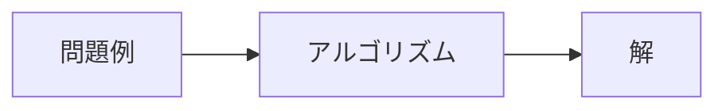

---
kernelspec:
  name: python3
  display_name: 'Python 3'
---

# 探索による問題解決

:::{important} Objective 
- コンピューターを使って問題を解決する方法を理解する。
- アルゴリズムの考え方を理解する。
- 幅優先探索（BFS）を迷路問題に適用できる。
- さまざまな問題を探索アルゴリズムで解決できることを理解する。
:::


## 考えてみよう

田中さんは、法政大学のオープンキャンパスに参加するため、横浜駅から東小金井駅までの最も時間のかからないルートを探している。

以下の図は、簡略化された鉄道路線図である。それぞれの頂点は駅を表し、頂点間の辺は鉄道路線を表している。辺の重みは、駅間の移動にかかる時間（分）を表している。


```{code-cell} python
:tags: [remove-input, remove-output]
!pip install networkx
import networkx as nx
import matplotlib.pyplot as plt
```

```{code-cell} python
:tags: [remove-input]

from typing import Dict, Tuple, List, Optional

# === Data Definitions ===

StationCoords = Dict[str, Tuple[float, float]]
EdgeList = List[Tuple[str, str, int]]

stations: StationCoords = {
    "Higashi-Koganei": (35.701549, 139.523898),
    "Shinjuku": (35.689732, 139.700908),
    "Yokohama": (35.466102, 139.622140),
    "Tokyo": (35.681320, 139.767218),
    "Hachioji": (35.655670, 139.338986),
}

edges: EdgeList = [
    ("Higashi-Koganei", "Shinjuku", 22),
    ("Shinjuku", "Yokohama", 33),
    ("Yokohama", "Tokyo", 26),
    ("Shinjuku", "Tokyo", 15),
    ("Higashi-Koganei", "Hachioji", 32),
    ("Hachioji", "Yokohama", 50),
]

# === Utility Functions ===


def create_graph(
    stations: StationCoords, edges: EdgeList, bidirectional: bool = True
) -> nx.Graph:
    G = nx.Graph() if bidirectional else nx.DiGraph()
    G.add_nodes_from(stations.keys())
    G.add_weighted_edges_from(edges)
    if bidirectional:
        reverse_edges = [(v, u, w) for u, v, w in edges]
        G.add_weighted_edges_from(reverse_edges)
    return G


def get_position_map(stations: StationCoords) -> Dict[str, Tuple[float, float]]:
    return {name: (lon, lat) for name, (lat, lon) in stations.items()}


def compute_shortest_path(
    G: nx.Graph, source: str, target: str
) -> Tuple[List[str], int]:
    path = nx.shortest_path(G, source=source, target=target, weight="weight")
    time = nx.shortest_path_length(G, source=source, target=target, weight="weight")
    return path, time


def draw_network(
    G: nx.Graph,
    pos: Dict[str, Tuple[float, float]],
    shortest_path: Optional[List[str]] = None,
) -> None:
    plt.figure(figsize=(8, 5))

    # === Draw base nodes and edges ===
    nx.draw_networkx_nodes(G, pos, node_size=100, node_color="#1f78b4", alpha=0.8)
    nx.draw_networkx_edges(G, pos, edge_color="lightgray", width=2)

    # === Highlight shortest path ===
    if shortest_path and len(shortest_path) > 1:
        path_edges = list(zip(shortest_path[:-1], shortest_path[1:]))
        nx.draw_networkx_edges(
            G, pos, edgelist=path_edges, edge_color="crimson", width=3, alpha=0.9
        )
        nx.draw_networkx_nodes(
            G,
            pos,
            nodelist=shortest_path,
            node_color="crimson",
            node_size=100,
            alpha=0.9,
        )

    # === Labels for nodes ===
    for station, (x, y) in pos.items():
        offset = 0.01 if station != "Yokohama" else -0.01
        va = "bottom" if station != "Yokohama" else "top"
        plt.text(
            x,
            y + offset,
            station,
            fontsize=10,
            ha="center",
            va=va,
            bbox=dict(
                facecolor="white", edgecolor="gray", boxstyle="round,pad=0.3", alpha=0.9
            ),
        )

    # === Edge labels (travel time) ===
    edge_labels = {(u, v): f"{d} min" for u, v, d in G.edges(data="weight")}
    nx.draw_networkx_edge_labels(G, pos, edge_labels=edge_labels, font_size=8)

    # === Decorations ===
    plt.title("Train Route Network", fontsize=14, fontweight="bold")
    plt.xlabel("")
    plt.ylabel("")
    plt.tight_layout()
    plt.show()


# Define source/target and execute
source = "Yokohama"
target = "Higashi-Koganei"

graph = create_graph(stations, edges)
pos = get_position_map(stations)

draw_network(graph, pos)
```

次の問題を考えてみよう。

1. 横浜駅から東小金井駅までの最も時間のかからないルートはどれか？
2. あなたはどのようにしてこのルートを見つけたのか？

```{code-cell} python
:tags: [hide-cell, remove-input]
# shortest path
path, time = compute_shortest_path(graph, source, target)
print("Best Route:", " ➝ ".join(path))
print("Estimated Time:", time, "minutes")
draw_network(graph, pos, shortest_path=path)
```

## 問題の理解

- 出発地：横浜駅
- 目的地：東小金井駅
- 行動：鉄道を利用して、駅から駅へ移動する
- 制約：図に示された鉄道路線図に従う
- 目標：移動時間の最小とするルートを見つける

## 数学モデルと解

### 数学モデル

- **初期状態**：横浜駅
- **目標状態**：東小金井駅
- **状態空間**：横浜駅、東小金井駅、東京駅、八王子駅などの駅の集合
- **行動**：与えられた状態ごとに、実行可能な行動が定義される
  - 現在の状態が横浜駅のとき、実行可能な行動は「八王子駅へ行く」「東京駅へ行く」「新宿駅へ行く」
  - 現在の状態が東小金井駅のとき、実行可能な行動は「新宿駅へ行く」「八王子駅へ行く」
- **状態遷移**：行動を実行することで、状態が変化する
  - 現在の状態が横浜駅のとき、「八王子駅へ行く」行動を実行すると、次の状態は八王子駅に変化する
- **コスト**：行動を実行することで、コストが発生する
  - 「八王子駅へ行く」行動は、移動時間が50分かかる

### 解

- **解**：初期状態から目標状態へ到達するための一連の行動
  - 横浜駅 -> 東京駅 -> 新宿駅 -> 東小金井駅
  - 横浜駅 -> 八王子駅 -> 東小金井駅
- **最適解**：総コストが最小となる解
  - 横浜駅 -> 新宿駅 -> 東小金井駅（総コストは55分）

```{code-cell} python
:tags: [remove-input]
draw_network(graph, pos, shortest_path=path)
```

## 最短経路問題

一般的に、頂点と辺の集合で構成されているものを**グラフ**と呼ぶ。グラフにおいて、ある二つの頂点間を最短で結ぶ経路を求める問題は、**最短経路問題**と呼ばれる。

次の図に示すように、さまざまなグラフが存在する。

```{code-cell} python
:tags: [remove-input]
import matplotlib.pyplot as plt
import networkx as nx
import random

# Generate graphs of different scales
G_small = nx.gnm_random_graph(5, 10, seed=0, directed=False)
G_medium = nx.gnm_random_graph(10, 15, seed=1, directed=False)
G_large = nx.gnm_random_graph(20, 25, seed=5, directed=False)

# Assign random weights to edges
for G in [G_small, G_medium, G_large]:
    for u, v in G.edges():
        G[u][v]["weight"] = round(random.uniform(1, 10), 1)

# Compute layouts
pos_small = nx.spring_layout(G_small, seed=1)
pos_medium = nx.spring_layout(G_medium, seed=2)
pos_large = nx.spring_layout(G_large, seed=3)

# Plot the graphs
fig, axs = plt.subplots(1, 3, figsize=(18, 6))

# Small graph
nx.draw(G_small, pos_small, with_labels=True, ax=axs[0], node_color="lightblue")
nx.draw_networkx_edge_labels(
    G_small,
    pos_small,
    edge_labels={(u, v): G_small[u][v]["weight"] for u, v in G_small.edges()},
    ax=axs[0],
)
axs[0].set_title("Graph with 5 nodes")

# Medium graph
nx.draw(
    G_medium,
    pos_medium,
    with_labels=True,
    ax=axs[1],
    node_color="lightgreen",
    font_size=8,
)
nx.draw_networkx_edge_labels(
    G_medium,
    pos_medium,
    edge_labels={(u, v): G_medium[u][v]["weight"] for u, v in G_medium.edges()},
    ax=axs[1],
    font_size=6,
)
axs[1].set_title("Graph with 10 nodes")

# Large graph
nx.draw(
    G_large,
    pos_large,
    with_labels=True,
    ax=axs[2],
    node_color="lightcoral",
    font_size=6,
)
nx.draw_networkx_edge_labels(
    G_large,
    pos_large,
    edge_labels={(u, v): G_large[u][v]["weight"] for u, v in G_large.edges()},
    ax=axs[2],
    font_size=4,
)
axs[2].set_title("Graph with 15 nodes")

plt.tight_layout()
plt.show()
```

小規模な問題は手作業で解くこともできるが、規模が大きくなると、手作業では解くことが難しくなる。そこで、コンピューターを使って問題を解くための**アルゴリズム**が必要になる。

:::{note}
アルゴリズムとは、問題を解決するための手順のことを指す。


:::

- どうなグラフに対しても、与えられた二つの頂点間の最短経路を求めるアルゴリズムがあるか？
- そのアルゴリズムをどのように記述して、どのように実装するのか？
- そのアルゴリズムは社会でどのように利用されているのか？

## 探索アルゴリズム

最短経路問題を解くための最も単純な方法は、初期状態から目標状態に到達するまでの**すべての可能な経路を列挙**し、最もコストの低い経路を選ぶことである。

ここでは、代表的な探索アルゴリズムの一つである**幅優先探索**（BFS, Breadth-First Search）を紹介する。

アルゴリズムを紹介するために、以下のグラフにおけるAからEへの最短経路を求める問題を考える。

```{code-cell} python
:tags: [remove-input]
# Create a graph with nodes and edges
G = nx.Graph()
G.add_nodes_from(["A", "B", "C", "D", "E"])
G.add_edge("A", "B", weight=4)
G.add_edge("A", "D", weight=2)
G.add_edge("B", "D", weight=1)
G.add_edge("B", "C", weight=8)
G.add_edge("C", "D", weight=5)
G.add_edge("C", "E", weight=3)
G.add_edge("D", "E", weight=9)

# Create a list of edges in the shortest path
path_edges = list(zip(path, path[1:]))

# Visualize the graph
pos = nx.spring_layout(G, seed=1)  # Position nodes using spring layout
nx.draw_networkx_nodes(G, pos, node_size=100, node_color="lightblue", alpha=0.8)
nx.draw_networkx_edges(G, pos, edge_color="lightgray", width=2)
nx.draw_networkx_labels(G, pos)
nx.draw_networkx_edge_labels(
    G, pos, edge_labels={(u, v): d["weight"] for u, v, d in G.edges(data=True)}
)

plt.show()
```

幅優先探索は、**探索木**（search tree）を使用し、系統的に状態を探索する方法である。

```python
def sear
```

**Step 1:** 初期状態Aから探索を開始する。

頂点Aを展開し、Aから到達可能な頂点はBとDである。

ここでは、リストを記号$Q$で表し、$Q=(\text{B}, \text{D})$とする。

**Step 2:** リスト$Q$から最初の頂点Bを取り出し、Bを展開する。

Bから到達可能な頂点はA、C、D、Eである。

:::{note}
この時点で、目標状態Eに到達したため、一つの解が得られた。探索木に従い、EからAに戻る経路は唯一のものである。それを逆にすると、解は「A → B → E」となる。また、コストの合計は6 + 3 = 9である。
:::

**Step 3:** リスト$Q$から最初の頂点Dを取り出し、Dを展開する。
