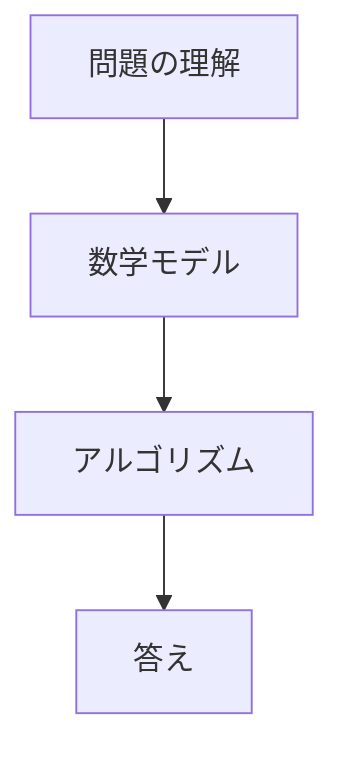
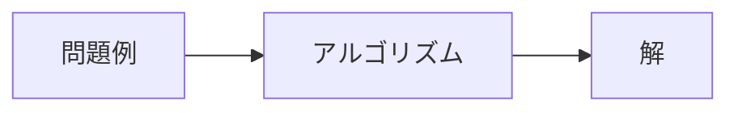
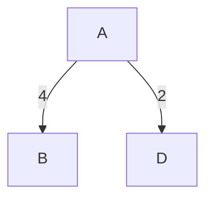
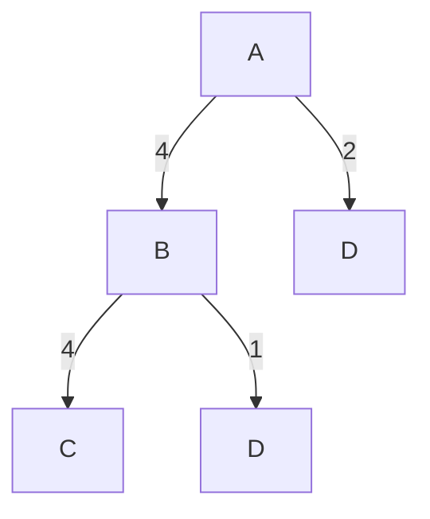
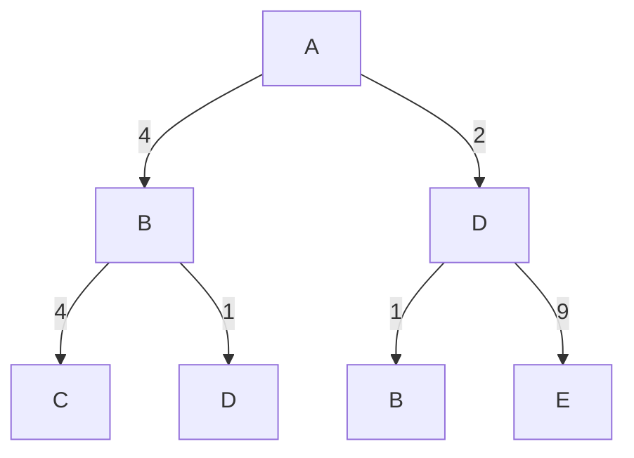
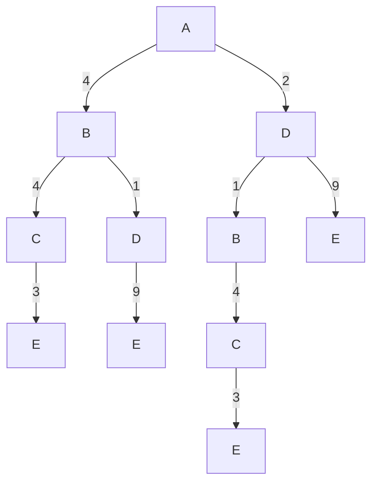

---
kernelspec:
  name: python3
  display_name: 'Python 3'
---

# 探索による問題解決

:::{important} 学習目標 
- コンピュータがどのようにして「問題を解く」のか、その考え方を知る
- アルゴリズムの基本的な考え方を理解する
- 探索アルゴリズムが、いろいろな現実の問題にも役立つことを知る
:::


## クイズ

````{prf:example}
:nonumber:

田中さんは、法政大学のオープンキャンパスに参加するため、横浜駅から東小金井駅まで、「横浜駅」から「東小金井駅」までできるだけ早く行きたいと思っている。

下の図は、電車路線を単純化したものである。頂点は駅、線は駅と駅を結ぶ線路を表し、数値は、所要時間（分）を表す。

```{code-cell} python
:tags: [remove-input, remove-output]
!pip install networkx
!pip install matplotlib
import networkx as nx
import matplotlib.pyplot as plt
```

```{code-cell} python
:tags: [remove-input]

import networkx as nx
import matplotlib.pyplot as plt

from typing import Dict, Tuple, List, Optional

# enable Japanese characters in matplotlib
plt.rcParams["font.family"] = "Noto Sans CJK JP"

# === Data Definitions ===

StationCoords = Dict[str, Tuple[float, float]]
EdgeList = List[Tuple[str, str, int]]

stations: StationCoords = {
    "東小金井": (35.701549, 139.523898),
    "新宿": (35.689732, 139.700908),
    "横浜": (35.466102, 139.622140),
    "東京": (35.681320, 139.767218),
    "八王子": (35.655670, 139.338986),
}

edges: EdgeList = [
    ("東小金井", "新宿", 22),
    ("新宿", "横浜", 33),
    ("横浜", "東京", 26),
    ("新宿", "東京", 15),
    ("東小金井", "八王子", 32),
    ("八王子", "横浜", 50),
]

# === Utility Functions ===


def create_graph(
    stations: StationCoords, edges: EdgeList, bidirectional: bool = True
) -> nx.Graph:
    G = nx.Graph() if bidirectional else nx.DiGraph()
    G.add_nodes_from(stations.keys())
    G.add_weighted_edges_from(edges)
    if bidirectional:
        reverse_edges = [(v, u, w) for u, v, w in edges]
        G.add_weighted_edges_from(reverse_edges)
    return G


def get_position_map(stations: StationCoords) -> Dict[str, Tuple[float, float]]:
    return {name: (lon, lat) for name, (lat, lon) in stations.items()}


def compute_shortest_path(
    G: nx.Graph, source: str, target: str
) -> Tuple[List[str], int]:
    path = nx.shortest_path(G, source=source, target=target, weight="weight")
    time = nx.shortest_path_length(G, source=source, target=target, weight="weight")
    return path, time


def draw_network(
    G: nx.Graph,
    pos: Dict[str, Tuple[float, float]],
    shortest_path: Optional[List[str]] = None,
) -> None:
    plt.figure(figsize=(8, 4))

    # === Draw base nodes and edges ===
    nx.draw_networkx_nodes(G, pos, node_size=80, node_color="#1f78b4", alpha=0.8)
    nx.draw_networkx_edges(G, pos, edge_color="lightgray", width=2)

    # === Highlight shortest path ===
    if shortest_path and len(shortest_path) > 1:
        path_edges = list(zip(shortest_path[:-1], shortest_path[1:]))
        nx.draw_networkx_edges(
            G, pos, edgelist=path_edges, edge_color="crimson", width=3, alpha=0.9
        )
        nx.draw_networkx_nodes(
            G,
            pos,
            nodelist=shortest_path,
            node_color="crimson",
            node_size=100,
            alpha=0.9,
        )

    # === Labels for nodes ===
    for station, (x, y) in pos.items():
        offset = 0.01 if station != "横浜" else -0.01
        va = "bottom" if station != "横浜" else "top"
        plt.text(
            x,
            y + offset,
            station,
            fontsize=12,
            ha="center",
            va=va,
            bbox=dict(
                facecolor="white", edgecolor="gray", boxstyle="round,pad=0.3", alpha=0.9
            ),
        )

    # === Edge labels (travel time) ===
    edge_labels = {(u, v): f"{d} min" for u, v, d in G.edges(data="weight")}
    nx.draw_networkx_edge_labels(G, pos, edge_labels=edge_labels, font_size=10)

    # === Decorations ===
    # without 枠
    plt.axis("off")
    plt.tight_layout()
    plt.show()


# Define source/target and execute
source = "横浜"
target = "東小金井"

graph = create_graph(stations, edges)
pos = get_position_map(stations)

draw_network(graph, pos)

```

横浜駅から東小金井駅まで、最短で到達するための経路はどれか？

1. 横浜駅 ➝ 新宿駅 ➝ 東小金井駅
2. 横浜駅 ➝ 東京駅 ➝ 新宿駅 ➝ 東小金井駅
3. 横浜駅 ➝ 八王子駅 ➝ 東小金井駅

```{code-cell} python
:tags: [hide-cell, remove-input]
# shortest path
path, time = compute_shortest_path(graph, source, target)
print("答え:", " ➝ ".join(path))
print("時間:", time, "分")
draw_network(graph, pos, shortest_path=path)
```
````

🤔コンピューターはどのようにしてこの問題を解くのだろうか？


## 問題解決の手順



## 問題の理解

- 出発地：横浜駅
- 目的地：東小金井駅
- 手段：電車を利用して、駅から駅へ移動する
- 制約：決められた路線図にしたがって移動する
- 目標：合計の移動時間が最も短くなるようにする

## モデリング

:::{note} 数学モデル
- **初期状態**：横浜駅
- **目標状態**：東小金井駅
- **状態空間**：駅全体（横浜、新宿、八王子、東京など）
- **行動**：ある駅から別の駅へ移動すること
- **状態遷移**：移動によって駅が変わること
- **コスト**：各移動にかかる時間（分）

:::{tip} 数式
:class: dropdown

この模擬授業では、複雑な数学記号を使わないが、上記の内容を数式で表すと以下のようになる。

- **初期状態**：$s_0$
- **目標状態**：$s_T$
- **状態空間**：$\mathcal{S} = \{s_0, s_1, s_2, \ldots, s_n\}$
- **行動**：$a_i \in \mathcal{A}$
- **状態遷移確率**：$p(s_{t+1} | s_t, a_t)$
- **コスト**：$c(s_t, a_t)$
:::

:::{note} 解と最適解

- **解**：初期状態から目標状態へ到達するための一連の行動
  - 横浜駅 -> 東京駅 -> 新宿駅 -> 東小金井駅
  - 横浜駅 -> 八王子駅 -> 東小金井駅
- **最適解**：その中で、総移動時間（コスト）が最も少ない経路
  - 横浜駅 -> 新宿駅 -> 東小金井駅（総コストは55分）
```{code-cell} python
:tags: [remove-input]
draw_network(graph, pos, shortest_path=path)
```
:::

上記の言葉を使って、探索は以下のように定義できる。

:::{note}　探索

**初期状態**から**目標状態**へ到達するための一連の**行動**を見つける作業

:::

### 問題例：8パズル

```{figure} ./images/8-puzzle.svg
:width: 300px
:align: center
:alt: 8-puzzle
:label: 8-puzzle

8パズルの例。初期状態が与えられ、数字のついたコマをスライドさせて目標状態に到達するゲーム。
```

### 問題例：迷路

```{figure} https://upload.wikimedia.org/wikipedia/commons/8/88/Maze_simple.svg
:width: 300px
:align: center
:alt: maze
:label: maze

迷路の例。スタート地点（初期状態）からゴール地点（目標状態）までの経路を見つけるゲーム。

Image by Jkwchui / CC0 1.0 (Public Domain)
```


## 最短経路問題

🤔では、どうやって探索するのか？

ここでは抽象化した例で説明を進める。

````{prf:example}
:nonumber:

今、初期状態Aから、目標状態Eへ到達するための経路を探索する問題を考える。

```{code-cell} python
:tags: [remove-input]
# Create a graph with nodes and edges
G = nx.Graph()
G.add_nodes_from(["A", "B", "C", "D", "E"])
G.add_edge("A", "B", weight=4)
G.add_edge("A", "D", weight=2)
G.add_edge("B", "C", weight=4)
G.add_edge("B", "D", weight=1)
G.add_edge("C", "E", weight=3)
G.add_edge("D", "E", weight=9)

# Create a list of edges in the shortest path
path_edges = list(zip(path, path[1:]))

node_color = "lightblue"  # Color for nodes
edge_color ="lightgray"  # Color for edges

# Visualize the graph
pos = nx.spring_layout(G, seed=1)  # Position nodes using spring layout
nx.draw_networkx_nodes(G, pos, node_size=300, node_color=node_color, alpha=1)
nx.draw_networkx_edges(G, pos, edge_color=edge_color, width=2)
nx.draw_networkx_labels(G, pos)
nx.draw_networkx_edge_labels(
    G, pos, edge_labels={(u, v): d["weight"] for u, v, d in G.edges(data=True)}
)

plt.show()
```
````

グラフ
: 頂点と辺で構成される構造。

最短経路問題
: ある二つの頂点間を最短で結ぶ経路を求める問題。

次の図に示すように、グラフには小規模なものもあれば、非常に多くの頂点や辺をもつ大規模なものもある。小規模な問題であれば、手作業で最短経路を見つけることも可能であるが、グラフの規模が大きくなると、手作業では解決が難しくなる。

```{code-cell} python
:tags: [remove-input]
import matplotlib.pyplot as plt
import networkx as nx
import random

# Generate graphs of different scales
G_small = nx.gnm_random_graph(5, 10, seed=0, directed=False)
G_medium = nx.gnm_random_graph(10, 15, seed=1, directed=False)
G_large = nx.gnm_random_graph(20, 25, seed=5, directed=False)

# Assign random weights to edges
for G in [G_small, G_medium, G_large]:
    for u, v in G.edges():
        G[u][v]["weight"] = round(random.uniform(1, 10), 1)

# Compute layouts
pos_small = nx.spring_layout(G_small, seed=1)
pos_medium = nx.spring_layout(G_medium, seed=2)
pos_large = nx.spring_layout(G_large, seed=3)

# Plot the graphs
fig, axs = plt.subplots(1, 3, figsize=(18, 6))

# Small graph
nx.draw(G_small, pos_small, with_labels=True, ax=axs[0], node_color="lightblue")
nx.draw_networkx_edge_labels(
    G_small,
    pos_small,
    edge_labels={(u, v): G_small[u][v]["weight"] for u, v in G_small.edges()},
    ax=axs[0],
)
axs[0].set_title("Graph with 5 nodes")

# Medium graph
nx.draw(
    G_medium,
    pos_medium,
    with_labels=True,
    ax=axs[1],
    node_color="lightgreen",
    font_size=8,
)
nx.draw_networkx_edge_labels(
    G_medium,
    pos_medium,
    edge_labels={(u, v): G_medium[u][v]["weight"] for u, v in G_medium.edges()},
    ax=axs[1],
    font_size=6,
)
axs[1].set_title("Graph with 10 nodes")

# Large graph
nx.draw(
    G_large,
    pos_large,
    with_labels=True,
    ax=axs[2],
    node_color="lightcoral",
    font_size=6,
)
nx.draw_networkx_edge_labels(
    G_large,
    pos_large,
    edge_labels={(u, v): G_large[u][v]["weight"] for u, v in G_large.edges()},
    ax=axs[2],
    font_size=4,
)
axs[2].set_title("Graph with 15 nodes")

plt.tight_layout()
plt.show()
```

そこで必要になるのが**アルゴリズム**である。アルゴリズムをコンピューターに実装することで、最短経路を効率的に求めることができる。

:::{note}
アルゴリズムとは、問題を解決するための手順のことを指す。


:::

## 探索アルゴリズム

最も単純なアルゴリズムは、全ての可能な経路を**系統的**列挙し、その中から最短のものを選ぶ方法である。

ここでは、**探索木**（search tree）を使用し、経路を探索する方法を紹介する。

```{code-cell} python
:tags: [remove-input]
# Create a graph with nodes and edges
G = nx.Graph()
G.add_nodes_from(["A", "B", "C", "D", "E"])
G.add_edge("A", "B", weight=4)
G.add_edge("A", "D", weight=2)
G.add_edge("B", "C", weight=4)
G.add_edge("B", "D", weight=1)
G.add_edge("C", "E", weight=3)
G.add_edge("D", "E", weight=9)

# Create a list of edges in the shortest path
path_edges = list(zip(path, path[1:]))

node_color = "lightblue"  # Color for nodes
edge_color ="lightgray"  # Color for edges

# Visualize the graph
pos = nx.spring_layout(G, seed=1)  # Position nodes using spring layout
nx.draw_networkx_nodes(G, pos, node_size=300, node_color=node_color, alpha=1)
nx.draw_networkx_edges(G, pos, edge_color=edge_color, width=2)
nx.draw_networkx_labels(G, pos)
nx.draw_networkx_edge_labels(
    G, pos, edge_labels={(u, v): d["weight"] for u, v, d in G.edges(data=True)}
)

plt.show()
```

**Step 1:** 

初期状態Aから探索を開始する。

Aを展開し、BとDを得る。

```{code-cell} python
:tags: [remove-input]
# Create a graph with nodes and edges
G = nx.Graph()
G.add_nodes_from(["A", "B", "C", "D", "E"])
G.add_edge("A", "B", weight=4)
G.add_edge("A", "D", weight=2)
G.add_edge("B", "C", weight=4)
G.add_edge("B", "D", weight=1)
G.add_edge("C", "E", weight=3)
G.add_edge("D", "E", weight=9)

# Create a list of edges in the shortest path
path_edges = list(zip(path, path[1:]))

node_color = "lightblue"  # Color for nodes
edge_color = [
    "lightgray" if (u, v) not in [("A", "B"), ("A", "D")] else "crimson"
    for u, v in G.edges()
]

# Visualize the graph
pos = nx.spring_layout(G, seed=1)  # Position nodes using spring layout
nx.draw_networkx_nodes(G, pos, node_size=300, node_color=node_color, alpha=1)
nx.draw_networkx_edges(G, pos, edge_color=edge_color, width=2)
nx.draw_networkx_labels(G, pos)
nx.draw_networkx_edge_labels(
    G, pos, edge_labels={(u, v): d["weight"] for u, v, d in G.edges(data=True)}
)

plt.show()
```

これを探索木として表すと、以下のようになる。



次に、どの順番で頂点を探索していくかを決める必要がある。

以下のようなルールを定める。

- **ルール1**：同じレベルの頂点を全て探索してから、次のレベルの頂点を探索する。

**Step 2:** 

次に、Bを展開し、A、C、Dを得る。

ただし、再びAへ戻るような経路 (A, B, A)は、ループとなり、最適な経路ではないので、探索する必要はない。

```{code-cell} python
:tags: [remove-input]
# Create a graph with nodes and edges
G = nx.Graph()
G.add_nodes_from(["A", "B", "C", "D", "E"])
G.add_edge("A", "B", weight=4)
G.add_edge("A", "D", weight=2)
G.add_edge("B", "C", weight=4)
G.add_edge("B", "D", weight=1)
G.add_edge("C", "E", weight=3)
G.add_edge("D", "E", weight=9)

# Create a list of edges in the shortest path
path_edges = list(zip(path, path[1:]))

node_color = "lightblue"  # Color for nodes
# set (A, B) to color black, (B, C) and (B, D) to crimson, and other edges to light gray
edge_color = [
    "black" if (u, v) == ("A", "B") else
    "crimson" if (u, v) in [("B", "C"), ("B", "D")] else
    "lightgray"
    for u, v in G.edges()
]
# Visualize the graph
pos = nx.spring_layout(G, seed=1)  # Position nodes using spring layout
nx.draw_networkx_nodes(G, pos, node_size=300, node_color=node_color, alpha=1)
nx.draw_networkx_edges(G, pos, edge_color=edge_color, width=2)
nx.draw_networkx_labels(G, pos)
nx.draw_networkx_edge_labels(
    G, pos, edge_labels={(u, v): d["weight"] for u, v, d in G.edges(data=True)}
)

plt.show()
```

そのため、以下のルールを追加する。

- **ルール2**：(A, B, A)、(A, D, A)のようなすでに通過した頂点に再び戻るような経路（ループ）は、探索の対象から除外する。

探索木を更新すると、以下のようになる。



**Step 3:**

ルール1に従い、Dを展開し、BとEを得る。

```{code-cell} python
:tags: [remove-input]
# Create a graph with nodes and edges
G = nx.Graph()
G.add_nodes_from(["A", "B", "C", "D", "E"])
G.add_edge("A", "B", weight=4)
G.add_edge("A", "D", weight=2)
G.add_edge("B", "C", weight=4)
G.add_edge("B", "D", weight=1)
G.add_edge("C", "E", weight=3)
G.add_edge("D", "E", weight=9)

# Create a list of edges in the shortest path
path_edges = list(zip(path, path[1:]))

node_color = "lightblue"  # Color for nodes
# set (A, D) to color black, (B, D) and (D, E) to crimson, and other edges to light gray
edge_color = [
    "black" if (u, v) == ("A", "D") else
    "crimson" if (u, v) in [("B", "D"), ("D", "E")] else
    "lightgray"
    for u, v in G.edges()
]

# Visualize the graph
pos = nx.spring_layout(G, seed=1)  # Position nodes using spring layout
nx.draw_networkx_nodes(G, pos, node_size=300, node_color=node_color, alpha=1)
nx.draw_networkx_edges(G, pos, edge_color=edge_color, width=2)
nx.draw_networkx_labels(G, pos)
nx.draw_networkx_edge_labels(
    G, pos, edge_labels={(u, v): d["weight"] for u, v, d in G.edges(data=True)}
)

plt.show()
```

探索木を更新すると、以下のようになる。



:::{note}
(A, D, E)は目標状態のEに到達するため、一つの解となる。コストは11である。
:::

**Step 4:**

同じ手順を繰り返すと、最終的に以下のような探索木が得られる。

```{code-cell} python
:tags: [remove-input]
# Create a graph with nodes and edges
G = nx.Graph()
G.add_nodes_from(["A", "B", "C", "D", "E"])
G.add_edge("A", "B", weight=4)
G.add_edge("A", "D", weight=2)
G.add_edge("B", "C", weight=4)
G.add_edge("B", "D", weight=1)
G.add_edge("C", "E", weight=3)
G.add_edge("D", "E", weight=9)

# Create a list of edges in the shortest path
path_edges = list(zip(path, path[1:]))


node_color = "lightblue"  # Color for nodes
edge_color = "lightgray"  # Color for edges

# Visualize the graph
pos = nx.spring_layout(G, seed=1)  # Position nodes using spring layout
nx.draw_networkx_nodes(G, pos, node_size=300, node_color=node_color, alpha=1)
nx.draw_networkx_edges(G, pos, edge_color=edge_color, width=2)
nx.draw_networkx_labels(G, pos)
nx.draw_networkx_edge_labels(
    G, pos, edge_labels={(u, v): d["weight"] for u, v, d in G.edges(data=True)}
)

plt.show()
```



すべての頂点を探索した結果、以下のような解が得られた。

| 経路              | コスト             |
| ----------------- | ------------------ |
| A ➝ B ➝ C ➝ E     | 4 + 4 + 3 = 11     |
| A ➝ B ➝ D ➝ E     | 4 + 1 + 9 = 14     |
| A ➝ D ➝ B ➝ C ➝ E | 2 + 1 + 4 + 3 = 10 |
| A ➝ D ➝ E         | 2 + 9 = 11         |

最短経路は、A ➝ D ➝ B ➝ C ➝ Eで、コストは10である。

```{code-cell} python
:tags: [remove-input]
# Create a graph with nodes and edges
G = nx.Graph()
G.add_nodes_from(["A", "B", "C", "D", "E"])
G.add_edge("A", "B", weight=4)
G.add_edge("A", "D", weight=2)
G.add_edge("B", "C", weight=4)
G.add_edge("B", "D", weight=1)
G.add_edge("C", "E", weight=3)
G.add_edge("D", "E", weight=9)

# calculate the shortest path
shortest_path = nx.shortest_path(G, source="A", target="E", weight="weight")
shortest_path_length = nx.shortest_path_length(G, source="A", target="E", weight="weight")

# Visualize the graph with the shortest path highlighted
pos = nx.spring_layout(G, seed=1)  # Position nodes using spring layout
nx.draw_networkx_nodes(G, pos, node_size=300, node_color="lightblue", alpha=1)
nx.draw_networkx_edges(G, pos, edge_color="lightgray", width=2)
nx.draw_networkx_labels(G, pos)
nx.draw_networkx_edge_labels(
    G, pos, edge_labels={(u, v): d["weight"] for u, v, d in G.edges(data=True)}
)   
nx.draw_networkx_nodes(G, pos, nodelist=shortest_path, node_color="crimson", node_size=300, alpha=0.9)
nx.draw_networkx_edges(
    G, pos, edgelist=list(zip(shortest_path[:-1], shortest_path[1:])), edge_color="crimson", width=3
)
plt.title("Shortest Path from A to E")
plt.show()
```

### アルゴリズムの表現

以上で紹介した探索アルゴリズムは、**幅優先探索**（Breadth-First Search, BFS）と呼ばれる。次の図に示すように、1、2、3、4の順に探索を行う。

```{figure} https://upload.wikimedia.org/wikipedia/commons/3/33/Breadth-first-tree.svg
:label: bfs-figure
:alt: bfs-figure
:align: center

幅優先探索の例 © Alexander Drichel, CC BY-SA 3.0
```

:::{prf:algorithm} 幅優先探索
:label: bfs
:nonumber:
1. 初期状態から到達可能な頂点を列挙する。
2. 幅優先の順番で、頂点を展開し、隣接する頂点を列挙する。
   - すでに探索済みの頂点は除外する。
   - 目標状態に到達した場合、その経路を解として記録する。
   - 目標状態に到達していない場合、探索木に追加する。
3. 探索が終わるまで、手順2を繰り返す。
4. 得られた解の中から、コストが最も小さいものを選ぶ。
:::

:::{note}
深さ優先探索（Depth-First Search, DFS）は、幅優先探索と同様に、探索木を用いて経路を探索するアルゴリズムであるが、探索の順序が異なる。名前の通り、深さ優先で探索を行う。
:::

### 計算例：8パズル

```{figure} ./images/8-puzzle-bfs.svg
:width: 300px
:align: center
:alt: 8-puzzle-bfs
:label: 8-puzzle-bfs

8パズルの幅優先探索の例。最短で2手で目標状態に到達する。
```

### 計算時間

| 項目               | 値                               |
| ------------------ | -------------------------------- |
| 各頂点の隣接頂点数 | 10                               |
| 探索木の深さ       | 14                               |
| 計算能力           | 1秒あたり100万個の頂点を探索可能 |
| メモリ             | 無限大                           |
| 計算時間           | 約3.5年                          |

### アルゴリズムの改善

🤔より効率的なアルゴリズムは？

**最良優先探索**、**ダイクストラ法**、**分枝限定法**などのアルゴリズムは、以下のような工夫を行う。

- 幅優先で探索するのではなく、何らかの規則を用いて、次に探索する最も望ましいノードを選択する
  - 例えば、コストが最小のノードを選ぶ
- 探索しなくてもよいノードを除外する
  - 例えば、明らかに最適解ではないノードを探索しない

## プログラミング

上記のアルゴリズムを実装するのは難しそうだが、実は以下のように簡単に実装できる。

```python
from collections import deque


def bfs(graph, start, goal):
    queue = deque([(start, [start])])
    visited = set()

    while queue:
        current_node, path = queue.popleft()

        if current_node == goal:
            return path

        if current_node not in visited:
            visited.add(current_node)
            for neighbor in graph.get(current_node, []):
                if neighbor not in visited:
                    queue.append((neighbor, path + [neighbor]))

    return None
```

この資料に載せているほとんどの図は、プログラムで自動生成している。


## 実社会での応用例

### 例1：配送計画問題

````{figure} https://upload.wikimedia.org/wikipedia/commons/8/8b/Illustration_of_the_Vehicle_Routing_Problem.svg
:width: 300px
:align: center
:alt: vehicle-routing-problem
:label: vehicle-routing-problem

配送計画問題の例。配送センターから出発する複数のトラックが、各配送先へ荷物を届けるための最適なルートを探索する問題。Image by Zootos / CC BY-SA 4.0
````

### 例2：組立工程のレイアウト最適化

````{figure} https://ars.els-cdn.com/content/image/1-s2.0-S0952197625005305-gr1_lrg.jpg
:width: 300px
:align: center
:alt: layout
:label: layout

組立工程のレイアウト最適化の例。各工程を効率的に配置するための最適な順序を探索する。Image by Kawabe et al. (2025) / CC BY-NC-ND 4.0
````

### 例3：超大規模集積回路（VLSI）のレイアウト設計

```{figure} https://upload.wikimedia.org/wikipedia/commons/4/4e/Diopsis.jpg
:width: 300px
:align: center
:alt: vlsi-layout
:label: vlsi-layout

VLSIのダイ。VLSIは数万個の論理ゲートで構成される。VLSIのレイアウト設計最適化は、非常に難しい問題である。Image by J. M. C. Pereira / CC BY-SA 4.0
```

:::{important} Takeaway（学び） 
- 探索は、初期状態から目標状態へ到達するための一連の行動を見つける作業である。
- 系統的に探索を行うことで、手作業で簡単な**最短経路問題**や**迷路問題**を解決できる。
- 複雑な問題を解くには、**コンピュータ**と**プログラミング**が不可欠
- プログラムの設計図が**アルゴリズム**
:::

### 例4：AlphaGo

[AlphaGo](https://ja.wikipedia.org/wiki/AlphaGo)は、囲碁の最適な手を探索するために、深層学習と[モンテカルロ木探索](https://ja.wikipedia.org/wiki/モンテカルロ木探索)を組み合わせたアルゴリズムを使用している。世界トップ棋士である柯潔に勝利したことを機に、AlphaGoを人間との対局から引退させると発表した。

## 🔍もっと知りたい人へ

Wikipediaの内容は難しいので、以下の内容をカバーしている書籍を読むことをおすすめする。

- [グラフ理論](https://ja.wikipedia.org/wiki/グラフ理論)
- [最短経路問題](https://ja.wikipedia.org/wiki/最短経路問題)
- [巡回セールスマン問題](https://ja.wikipedia.org/wiki/巡回セールスマン問題)
- [力まかせ探索](https://ja.wikipedia.org/wiki/組合せ最適化)
- [分枝限定法](https://ja.wikipedia.org/wiki/分枝限定法)
- [ダイクストラ法](https://ja.wikipedia.org/wiki/ダイクストラ法)

## 経営システム工学って何？

> 数理科学で社会の諸問題を解決
> : 社会の様々な分野における意思決定やマネジメント全般の問題に対して、数学や統計学、計算機科学など、数理科学を基礎として解決をはかる立場を「経営システム工学」と呼びます。
> 
> -- [法政大学 経営システム工学科](https://ise-hp.ws.hosei.ac.jp/study/)

- 研究対象：社会の様々な分野における意思決定やマネジメント全般の問題
  - 例：生産システム、物流システム、交通システム、経済、金融など
  - 経営システムを含む、さまざまな社会システムの設計、分析、改善
- 研究手法：数学や統計学、計算機科学など
  - 例：最適化、シミュレーション、モデリング、データ分析、機械学習など

経営システム工学科の研究室は以下のような研究テーマを扱っている。詳細は[こちら](https://ise-hp.ws.hosei.ac.jp/research/)から。

- データサイエンス
- 人工知能・機械学習
- 数理最適化
- アルゴリズム
- モデリング
- 経済
- 金融
- 応用代数
- など